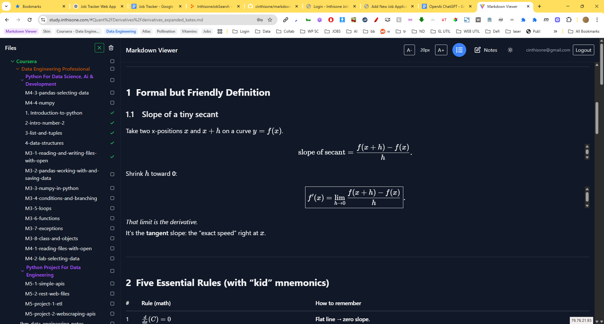

# Zip Markdown Viewer

A fast, offline-friendly, mobile-ready web app to browse and read Markdown files from a .zip archive. Features KaTeX math, syntax-highlighted code, and dark mode.

## Motivation

This project was created to provide a centralized place for storing and organizing study notes for data engineering and quantitative development work. Markdown was chosen as the primary format because it excels at handling both code snippets and mathematical formulas, making it perfect for technical documentation and learning materials.

## Features

- **Drag-and-drop or select a .zip** of Markdown files (≤ 200 MB)
- **Folder tree navigation** (unlimited nesting)
- **GitHub-flavored Markdown** (tables, task-lists)
- **KaTeX math** ($...$, $$...$$)
- **highlight.js** for code blocks (auto-detect)
- **Dark/light mode** (default: dark, persists)
- **Hash-based routing** (deep-link to any file)
- **Offline support** (stores files in IndexedDB)
- **No backend, no auth, no DB**

## Setup

```sh
git clone https://github.com/yourname/zip-md-viewer.git
cd zip-md-viewer
npm install
npm run dev
```

Open [http://localhost:5173](http://localhost:5173) and upload your `.zip`!

## Build & Deploy (e.g. GitHub Pages)

```sh
npm run build
# Copy dist/ to your static host, or for GitHub Pages:
npx gh-pages -d dist
```

Set `base` in `vite.config.ts` if deploying to a subpath.

## Screenshot



## Demo


## License

MIT
